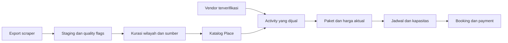
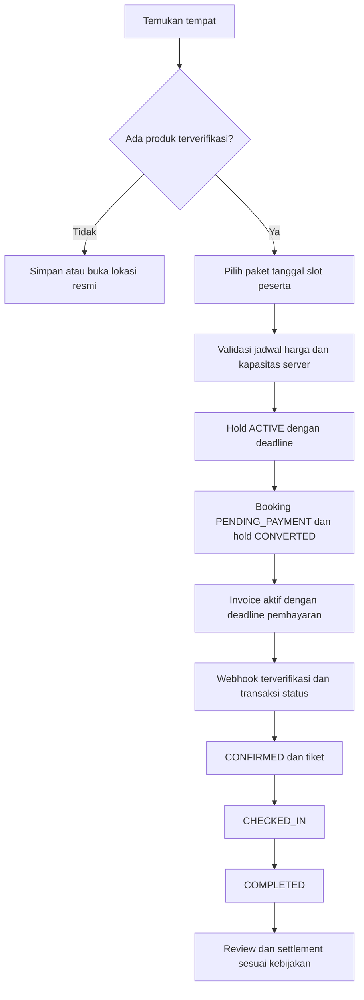

# Audit proyek dan arah redesign Bandung

Tanggal: 8 Oktober 2026. Checkout: `queenfish`, commit awal `b552de1`.
Nama produk di kode: **Tripora**; nama workspace: **JelajahIn**.

## Keputusan utama

Proyek sudah memiliki struktur MVP marketplace yang luas, tetapi belum layak dianggap selesai secara fungsional. Build dan unit test lolos, sementara beberapa kontrak antarlapis tidak konsisten: autentikasi dashboard, guest payment, perhitungan kapasitas, expiry pembayaran, dan saldo payout.

Arah yang direkomendasikan: **aplikasi jelajah tempat Bandung dengan booking aktivitas dari vendor terverifikasi**. Katalog tempat dan produk yang bisa dibeli perlu menjadi dua entitas berbeda. Data scraper berguna untuk memperkaya discovery, tetapi tidak memiliki bukti kemitraan vendor, inventory tiket, atau harga jual yang terverifikasi.

Ini hasil audit dan riset pendahuluan, bukan implementasi redesign atau perbaikan aplikasi. Prioritas dan kriteria penerimaan di bawah merupakan dasar pelaksanaan berikutnya.

## 1. Sampai mana proyek saat ini?

| Area | Yang sudah ada di kode | Penilaian saat audit |
| --- | --- | --- |
| Arsitektur | Monorepo Next.js, NestJS, Prisma/PostgreSQL/PostGIS, Redis/BullMQ | Fondasi tersedia; tidak perlu mengganti seluruh stack untuk redesign |
| Discovery | Home, explore/search, kategori, destinasi, detail aktivitas | UI dan endpoint ada; filter belum konsisten, data katalog terbatas |
| Data demo | Seed 6 destinasi, 4 vendor, 8 aktivitas, paket dan jadwal | Data demo, bukan inventaris 1.001 tempat Bandung |
| Customer | Registrasi, verifikasi, profil, trip, wishlist, review | Banyak query berhenti karena masih memakai `token` yang selalu null |
| Booking | Preview harga, hold, transaksi booking, batas peserta, cutoff | Kapasitas dan validasi relasi/tanggal perlu diperbaiki |
| Pembayaran | Mayar invoice, webhook, simulasi non-production | Jalur guest tidak konsisten; retry dan perubahan status belum atomik |
| Tiket/check-in | Token HMAC, QR, unique check-in, isolasi vendor | Fondasi ada; perubahan beberapa tabel belum satu transaksi |
| Vendor/staff/admin | Halaman operasional untuk masing-masing role | Banyak halaman belum memuat data akibat regresi auth; keberadaan halaman bukan bukti alur berfungsi |
| Refund/payout | Catatan refund, liability, ledger, persetujuan admin | Ada bookkeeping; bukan bukti uang dikembalikan/ditransfer oleh provider |
| Notifikasi | Queue dan worker email | Worker menandai SENT tanpa provider pengiriman email |
| Review | Review mensyaratkan booking COMPLETED | Tidak ditemukan jalur yang mengubah booking menjadi COMPLETED pada API/worker yang diaudit |
| Verifikasi | CI, typecheck, build, unit test | Pemeriksaan dasar lolos; belum menguji lifecycle dan concurrency |

Tidak diberikan persentase penyelesaian: belum ada daftar acceptance criteria yang seluruhnya diuji, sehingga persentase akan menyesatkan.

### Pemeriksaan yang benar-benar dijalankan

- `npm ci --ignore-scripts --no-audit --no-fund`: berhasil; dependency dipasang sesuai lockfile.
- `npm run db:generate`: berhasil, Prisma Client 6.12.0.
- `npm run typecheck`: berhasil untuk seluruh workspace yang memiliki task tersebut.
- `npm run lint -w @tripora/web`: berhasil.
- `npm run test -w @tripora/api -- --runInBand`: **4 suite, 15 test, seluruhnya lolos**.
- `npm run build -w @tripora/api` dan `npm run build -w @tripora/web`: berhasil; web memakai Next.js 15.5.25 dari lockfile.
- HTTP smoke pada web production lokal: `/`, `/explore`, dan `/search?date=2026-10-10&guests=5` merespons 200. Ini membuktikan rendering route, bukan keberhasilan pencarian/booking.
- Saat API lokal tidak berjalan, `/activities/rafting-sungai-palayangan` menampilkan judul **“Aktivitas tidak ditemukan”**. Respons streaming masih 200; masalah yang dibuktikan adalah pengaburan upstream failure menjadi tampilan not-found.

API, PostgreSQL, dan Redis lokal tidak mendengarkan pada port default saat diperiksa. Tidak dilakukan pembayaran nyata, migrasi DB, seed DB, atau transaksi vendor. Browser automation tidak memiliki browser yang tersambung, sehingga audit visual berbasis kode; belum ada screenshot, uji viewport nyata, Lighthouse, atau pengujian keyboard interaktif. Audit ini juga bukan pentest eksploitasi.

## 2. Temuan logic, dampak, dan perbaikan

P0 = menghalangi alur utama atau merusak kapasitas/keuangan. P1 = wajib dibereskan agar produk dan redesign konsisten. P2 = penguatan berikutnya. Temuan berikut berasal dari kode; skenario concurrency memerlukan reproduksi integrasi pada PostgreSQL sebelum dinyatakan sudah diperbaiki.

### P0-01. Dashboard dan wishlist terputus setelah migrasi cookie

**Bukti:** [providers.tsx](../apps/web/app/components/providers.tsx) menetapkan `token: null`, sementara pencarian kode menemukan **49 baris query enablement yang bergantung pada token**. Contohnya [account/trips](../apps/web/app/account/trips/page.tsx), halaman vendor/admin/staff, dan [checkin-client](../apps/web/app/components/checkin-client.tsx). Tombol wishlist detail aktivitas juga dibungkus `{token && ...}`.

**Dampak:** login dapat berhasil, tetapi query tetap disabled dan halaman menampilkan keadaan kosong. Wishlist tidak muncul meskipun pengguna login.

**Perbaikan:** gunakan status auth eksplisit seperti `loading`, `user`, dan kemampuan role/permission untuk mengaktifkan query. Cookie tetap menjadi kredensial API. Scope query key dengan user/vendor; hapus cache data privat ketika logout atau berganti akun. Jangan mengganti seluruh penggunaan kata `token`: token verifikasi email berbeda dengan token auth legacy.

**Acceptance:** masing-masing role memuat data setelah login; anonymous tidak memanggil API privat; pergantian akun tidak memperlihatkan cache akun sebelumnya.

### P0-02. Guest dapat membuat booking tetapi tidak dapat membuat pembayaran

**Bukti:** POST `/bookings` diberi `@Public()` pada [bookings.controller](../apps/api/src/modules/bookings/bookings.controller.ts), tetapi POST `/payments` pada [payments.controller](../apps/api/src/modules/payments/payments.controller.ts) memerlukan autentikasi. [checkout-client](../apps/web/app/components/checkout-client.tsx) memanggil kedua endpoint sebagai guest.

**Dampak:** checkout guest berhenti di pembuatan invoice; mode demo dapat menyamarkan kegagalan ini.

**Perbaikan:** definisikan otorisasi booking untuk guest berupa capability/credential yang diverifikasi server; gunakan pada create/resume payment, lookup, dan cancel. Jangan sekadar membuat pembayaran publik dengan booking code saja. Endpoint pembayaran pengguna login juga perlu ownership check: service saat ini menerima booking code tanpa konteks pemilik.

**Acceptance:** anonymous dapat menyelesaikan invoice untuk booking miliknya; mengetahui kode booking orang lain tidak memberi hak membuat/membaca pembayaran tersebut.

### P0-03. Booking pengguna login tidak otomatis terhubung ke akunnya

**Bukti:** [AuthGuard](../apps/api/src/common/services/auth.guard.ts) langsung `return true` untuk route public, sebelum memproses cookie dan mengisi `request.user`. POST booking mengirim `user?.id ?? null` ke service.

**Dampak:** dalam jalur yang tersedia, booking dari route public tercatat sebagai guest meskipun browser memiliki sesi login. Memperbaiki enablement dashboard saja belum membuat booking ini muncul di My Trips.

**Perbaikan:** bedakan public tanpa auth dengan optional-auth, atau sediakan command authenticated dan guest yang menggunakan service sama. Klaim guest booking ke akun memerlukan verifikasi kontak; jangan menghubungkan otomatis berdasarkan email yang diketik.

### P0-04. Kapasitas memakai jumlah baris, bukan jumlah peserta

**Bukti:** [availability.service](../apps/api/src/modules/availability/availability.service.ts), [reservations.service](../apps/api/src/modules/reservations/reservations.service.ts), dan [bookings.service](../apps/api/src/modules/bookings/bookings.service.ts) memakai `booking.count()` dan `reservation.count()`.

**Contoh:** kapasitas 10, booking 8 peserta dianggap menggunakan 1 kapasitas. UI dan backend dapat menganggap sisa 9, padahal sisa sebenarnya 2.

**Perbaikan:** jika kapasitas didefinisikan sebagai orang, gunakan SUM `participant_count` dan SUM `participants` dengan satu definisi status yang mengonsumsi kapasitas. Hold yang sudah CONVERTED tidak dihitung lagi. Jika ada paket unit kendaraan/meja, modelkan `capacity_unit` dan allocation unit secara eksplisit.

**Acceptance:** booking 8 peserta menyisakan 2; hold kedaluwarsa tidak dihitung; reservasi yang dikonversi tidak dihitung ganda; jumlah alokasi tidak melebihi kapasitas saat request serentak.

### P0-05. Pembuatan hold tidak atomik dan belum memvalidasi seluruh kontrak slot

**Bukti:** reservations menghitung kapasitas lalu membuat row tanpa transaksi/lock. `slotGuard` mengambil paket dari schedule; pemeriksaan `guard.schedule.package_id !== packageRow.id` membandingkan relasi yang memang sama, bukan dengan `dto.packageId`. Row reservasi justru memakai `dto.packageId`. Belum ada pemeriksaan jadwal ACTIVE dan kecocokan `day_of_week`/`specific_date` dengan tanggal yang diminta pada command create hold.

**Dampak:** hold serentak dapat melewati kapasitas; package ID dari request dapat tidak cocok dengan schedule; jadwal tanggal/hari berbeda dapat diajukan langsung ke API. Booking lock yang sudah ada tidak memperbaiki semua masalah di create hold.

**Perbaikan:** dalam transaksi yang sama, gunakan lock slot yang konsisten dengan create booking, validasi paket/schedule/aktivitas/vendor, kalender, blackout, cutoff, jumlah peserta, lalu buat hold. Terapkan tanggal kalender strict, bukan hanya regex atau normalisasi `Date`.

**Acceptance:** package mismatch, jadwal PAUSED, tanggal bukan hari schedule, dan tanggal kalender tidak valid ditolak; request hold serentak tidak melebihi kapasitas.

### P0-06. Expiry hold dan expiry pembayaran berbeda tetapi UI mencampurnya

**Bukti:** checkout memakai `reservation.expiresAt` untuk `expired` dan menghentikan payment polling setelah hold habis, bahkan setelah booking dibuat. Invoice memiliki expiry sendiri yang tidak dipakai sebagai deadline checkout. Worker memakai umur `booking.created_at` dan env 30 menit, sedangkan payment creation mengambil setting DB serta memulai expiry saat invoice dibuat. Model Payment belum menyimpan URL dan expiry invoice.

**Dampak:** pengguna dapat membayar invoice yang masih valid tetapi UI berhenti menunggu; invoice baru dapat bertahan setelah sweeper melepas booking; deadline admin setting, worker, dan UI berbeda.

**Perbaikan:** simpan `payment_expires_at` dan payment URL; setelah hold CONVERTED gunakan deadline pembayaran, bukan hold. Satu deadline server menjadi acuan UI, worker, dan gateway. Pembayaran terlambat setelah inventory dilepas masuk jalur rekonsiliasi/refund atau reacquire inventory, bukan langsung CONFIRMED.

### P0-07. Webhook dan pembatalan belum memakai perubahan status atomik

**Bukti:** [payments.service](../apps/api/src/modules/payments/payments.service.ts) menyimpan event, lalu payment, booking, ticket, notification secara terpisah. Event yang sudah ada langsung dianggap idempotent. Cancel pada bookings juga membaca status lalu melakukan beberapa update terpisah.

**Contoh kegagalan:** event tersimpan lalu proses mati sebelum ticket terbit. Retry menemukan event dan berhenti, sehingga side effect dapat tidak selesai. Dua event atau cancel versus payment dapat membaca status awal yang sama.

**Perbaikan:** atomic compare-and-set status dan transaksi untuk payment + booking + event processing state + ticket/outbox. Side effect eksternal dikirim oleh worker dari outbox yang dapat diulang. Resume invoice harus idempotent dan mengembalikan invoice aktif, bukan selalu membuat invoice baru serta menimpa reference.

**Acceptance:** webhook duplikat/serentak, crash di tengah proses, cancel versus paid, paid versus sweep, invoice retry, dan late payment menghasilkan status konsisten serta maksimal satu tiket.

### P0-08. Saldo payout memasukkan booking belum dibayar dan settlement tidak terikat item

**Bukti:** earning dibuat ketika booking masih PENDING_PAYMENT. [payouts.controller](../apps/api/src/modules/payouts/payouts.controller.ts) menjumlah semua earning PENDING tanpa filter payment/booking eligibility. Process payout me-release seluruh earning PENDING vendor, termasuk row baru setelah permintaan payout dibuat.

**Dampak:** booking belum dibayar dapat memperbesar saldo yang dapat diminta; payout untuk kumpulan lama dapat menandai earning baru seolah ikut dibayarkan.

**Perbaikan:** definisikan kapan earning tersedia, misalnya paid + aktivitas selesai + melewati penahanan refund. Pisahkan pending, available, reserved-for-payout, paid-out, dan reversed. Buat `PayoutItem` yang mengikat earning tertentu dan reserve nominal saat request; proses hanya item tersebut dalam transaksi. Refund/payout approval belum melakukan transfer provider, sehingga perlu status “disetujui” terpisah dari “uang berhasil dikirim”.

### P1-01. Rumus keuangan belum menjelaskan kepemilikan biaya platform

**Bukti:** booking memakai `vendorNet = totalAmount - commissionAmount`, dengan `totalAmount = subtotal - discount + platformFee`. Biaya platform ikut masuk net vendor.

**Keputusan bisnis yang diperlukan:** siapa menanggung diskon dan siapa menerima biaya layanan. Usulan jika biaya layanan milik platform dan diskon ditanggung vendor: `vendorNet = subtotal - vendorDiscount - commission`; `platformNet = serviceFee + commission - platformDiscount - gatewayFee`. Simpan komponen terpisah dan cocokkan total ledger. Ini usulan, bukan asumsi kebijakan yang sudah disetujui.

### P1-02. Search memiliki beberapa kontrak yang berbeda

**Bukti:** [explore-client](../apps/web/app/components/explore-client.tsx) menampilkan date/guests tetapi tidak memasukkan keduanya ke parameter/query key. [search.controller](../apps/api/src/modules/search/search.controller.ts) belum menerima date/guests; cabang FTS/geo mengabaikan min/max price; `total` memakai panjang satu halaman; ketika min dan max diberikan, spread `base_price` kedua menimpa yang pertama. Frontend belum menyediakan pagination. Keyword FTS hanya title/description, meski UI menyebut area/vendor.

**Perbaikan:** satu search contract untuk semua cabang. Validasi angka, radius, pagination, sort dan batas harga. Filter harga paket ACTIVE, bukan paket nonaktif. Hitung total keseluruhan atau gunakan `hasNextPage` yang jelas. Persist filter di URL dan pulihkan saat Back. Date/guests hanya berlaku untuk inventory yang bookable; filter tersebut tidak boleh memberi kesan katalog kafe memiliki slot terkonfirmasi.

### P1-03. Detail publik dan CTA booking belum memvalidasi visibility/state secara lengkap

**Bukti:** detail aktivitas dengan `findUnique` tidak memfilter PUBLISHED, detail paket tidak memfilter ACTIVE, dan public search menyertakan semua packages. Detail frontend memilih slot pertama yang `!soldOut`, bukan slot yang kapasitasnya cukup bagi jumlah peserta. `canBook` tidak memastikan active slot masih usable atau jumlah peserta berada dalam rentang paket; default peserta selalu 2.

**Perbaikan:** guard publik untuk aktivitas published, vendor approved, paket aktif dan jadwal berlaku. Backend tetap otoritatif. Frontend memilih slot yang layak, menyesuaikan jumlah peserta saat ganti paket, serta menonaktifkan CTA saat fetching/error/capacity insufficient.

### P1-04. Email verifikasi belum benar-benar dikirim

**Bukti:** [worker](../apps/worker/src/index.ts) hanya log dan update notification SENT; belum memanggil provider email. Registrasi mewajibkan verifikasi.

**Dampak:** akun pengguna normal dapat buntu di verifikasi, sementara UI/DB mengklaim sudah mengirim.

**Perbaikan:** provider email dengan retry dan delivery observability. SENT hanya setelah provider menerima pesan; DELIVERED jika callback mendukung. Worker update berdasarkan notification/job tertentu, bukan seluruh queued notification pengguna. Outbox yang enqueue gagal harus benar-benar diproses ulang.

### P1-05. Completion, refund, dan check-in memerlukan lifecycle yang jelas

**Bukti:** check-in mengubah status menjadi CHECKED_IN, review hanya untuk COMPLETED, dan tidak ditemukan command/sweeper completion. Refund reject selalu mengembalikan CONFIRMED, meskipun permintaan dapat berasal dari CHECKED_IN/COMPLETED. Check-in/refund update beberapa tabel terpisah.

**Perbaikan:** definisikan completion oleh operator atau setelah jadwal berakhir; simpan previous state untuk refund rejection; idempotent transaction untuk check-in/refund. Tetapkan satu tiket grup atau tiket per peserta, karena implementasi saat ini satu tiket per booking.

### P1-06. Upstream error dan data kosong menyamar sebagai hasil normal

**Bukti:** [apiPublic](../apps/web/app/lib/api.ts) mengembalikan null pada semua error; detail memanggil notFound. Homepage memakai `data ?? []`, sehingga API gagal dapat membuat jumlah aktivitas 0 dan blok hilang. Error explore menampilkan instruksi `npm run api` dan env kepada pengguna.

**Perbaikan:** bedakan empty, not found, forbidden, offline, upstream failure. Tampilkan retry dan pesan pengguna biasa; simpan detail teknis pada log. Gunakan katalog publik yang dirender server/cache, sedangkan availability/harga/sesi bersifat dinamis.

### P2. SEO, gambar, dan audit coverage

Canonical root `https://tripora.id` diwariskan dari layout; perlu canonical per halaman dan domain konfigurabel saat deployment. Pertahankan slug lama serta redirect eksplisit untuk perubahan yang diputuskan. Tambahkan metadata/OG aktual, breadcrumb, sitemap dan structured data hanya untuk fakta yang tersedia.

`imageFor` memakai foto rafting untuk semua aktivitas tanpa gambar; daftar paket kosong menjadi harga Rp0. `next.config` hanya mengizinkan picsum, sehingga URL foto dataset belum bisa langsung dipakai dengan next/image. Jangan mengartikan tidak ada harga sebagai gratis. Asset pipeline perlu source, atribusi/izin, validasi URL dan image fallback yang jujur.

Unit test yang ada mencakup provider Mayar, util waktu/kontak, dan permission helper. Tambahkan integrasi PostgreSQL dan tes alur browser untuk temuan P0; typecheck tidak dapat mendeteksi bug bisnis tersebut.

## 3. Data Bandung yang ditemukan

Lokasi sebenarnya: `D:\Project\scrapper data\scrapper bandung`.
File utama: `places.json`, `places.csv`, `scraper_bandung.py`, `checkpoint_bandung.json`, `server_bandung.py`.

Audit menghitung isi JSON secara penuh. Profil dan fingerprint sumber tersedia di [bandung-data-profile.json](bandung-data-profile.json). File sumber tidak diubah.

| Kelompok | Jumlah |
| --- | ---: |
| Cafe & Tempat Ngopi | 417 |
| Kuliner & Restoran | 343 |
| Hiburan & Tempat Main | 138 |
| Wisata & Rekreasi Alam | 103 |
| **Total / unique place_id** | **1.001 / 1.001** |

Field tersedia: nama, kategori, subkategori, area, alamat, koordinat, rating, jumlah review, telepon, WhatsApp, website, ringkasan jam buka, estimasi harga, foto, Maps URL, query asal, dan waktu pembaruan. Export ini diperbarui pada **1 Oktober 2026**.

### Kualitas dan batas pemakaian

| Pemeriksaan | Hasil | Implikasi produk |
| --- | --- | --- |
| Duplikasi place_id/nama persis ter-normalisasi | Tidak ditemukan | Tetap cek branch/tempat sama dengan nama berbeda saat kurasi |
| Harga | Seluruh 1.001 memakai 4 rentang berdasarkan kategori | Kode scraper hardcode; bukan tiket/menu/harga vendor aktual |
| Foto | 974 URL Googleusercontent, 27 Unsplash | 27 fallback bukan bukti foto venue; URL Google belum diverifikasi ketersediaan/izin/atribusi |
| Telepon / WhatsApp / website terisi | 758 / 757 / 402 | Field terisi tidak berarti terverifikasi |
| WhatsApp dari nomor dengan prefix telepon tetap | 144 | Link dibentuk scraper dari nomor; jangan klaim seluruhnya WhatsApp resmi |
| Rating 4.5 | 168 | Scraper juga memiliki default 4.5; export tidak membedakan rating asli dan fallback |
| Jumlah review 0 | 20 | Perlu pemeriksaan ulang; jangan buat social proof atau ulasan aplikasi dari data ini |
| Jam buka tidak diketahui | 106 | Ringkasan parsial tidak cukup untuk fitur “buka sekarang” |
| Status buka | “Buka Normal”, “Buka / Cek Jadwal”, “Buka 24 Jam” | Label hasil parser, bukan business status verified/realtime |
| Di luar bounding box pemeriksaan | 3 kandidat | Screening, bukan keputusan batas administratif |

Tiga kandidat lokasi untuk karantina/manual review: **Nebula Outbound Adventure** (koordinat jauh dari Bandung meski alamat fallback Bandung), **Ngopi Di Sawah** (Bogor), dan **Golf1 Driving Range and Cafe @Buperta Cibubur** (Depok). Gunakan batas wilayah yang disepakati sebelum menentukan hasil import final.

`district` mencampur kecamatan, kawasan wisata, dan kabupaten, misalnya Bandung Wetan, Braga, Dago, Lembang, dan Kabupaten Bandung. Pisahkan `administrative_area` dari `discovery_area`; jangan memaksakan semuanya menjadi kecamatan.

### Model data target



**Place** disarankan memiliki external ID, nama/slug stabil, kategori banyak-ke-banyak, alamat, area administratif/discovery, koordinat nullable, kontak dan status verifikasi, jam mingguan terstruktur jika tersedia, external rating dengan sumber, media dengan provenance, `source_updated_at`, `last_verified_at`, serta quality flags. `source_updated_at` tidak sama dengan `last_verified_at`.

**Activity/Package** tetap produk vendor dengan kebijakan, unit harga, harga aktual, cutoff, kapasitas, jadwal, dan status publikasi. Satu Place dapat punya banyak activity/operator; satu tempat tidak wajib punya produk booking. External rating tidak digabung dengan review transaksi Tripora.

Katalog tanpa paket: CTA **Lihat lokasi**, **Simpan**, **Lihat situs resmi**; hubungi WhatsApp hanya setelah channel tersebut terkonfirmasi. Katalog dengan produk aktif: tambah **Lihat paket**. Jangan membuat vendor dummy atau jadwal/harga palsu untuk mengimpor semua venue sebagai Activity.

### Pipeline import yang disarankan

1. Snapshot sumber + SHA256; simpan raw staging untuk audit lokal.
2. Validate schema, format kontak/URL, koordinat, dedupe external ID, dan scope Bandung Raya.
3. Tandai synthetic price, suspect/default rating, stock photo, unknown hours, inferred WhatsApp, dan out-of-region.
4. Normalisasi taxonomy multi-kategori serta area; kategori tunggal hasil scraper belum tentu mencerminkan semua fungsi venue.
5. Kurasi foto/kontak/jam dan informasi penting dari pemilik atau sumber yang diizinkan.
6. Dry-run import dengan ringkasan create/update/quarantine; idempotent upsert berdasarkan source + external ID. Jangan overwrite field vendor yang sudah diverifikasi dengan hasil scraper baru.
7. Publikasikan bertahap tempat yang lolos quality gate; aktifkan booking hanya melalui onboarding vendor dan produk terverifikasi.

Penggunaan sumber Google perlu ditinjau khusus: scraper ini memakai RPC langsung, bukan integrasi resmi Places API. Dokumentasi resmi **Places API** membatasi penyimpanan konten dan mengatur atribusi, dengan pengecualian tertentu untuk place_id. Itu tidak otomatis menentukan izin dataset hasil scraper ini. Untuk produk publik, tentukan sumber/media yang memang boleh digunakan dan catat atribusinya. [Kebijakan resmi Places API](https://developers.google.com/maps/documentation/places/web-service/policies).

Profil ulang tanpa mengubah dataset:

```powershell
python scripts/profile-bandung-data.py "D:\Project\scrapper data\scrapper bandung\places.json" --output audit/bandung-data-profile.json
```

## 4. Referensi riset dan penerapannya

Ini benchmark produk dan UX, bukan user interview lokal atau bukti bahwa seluruh pola kompetitor cocok untuk Tripora. Rekomendasi adalah sintesis dari benchmark dan kondisi proyek.

| Referensi yang diperiksa | Pola yang relevan | Adaptasi untuk proyek |
| --- | --- | --- |
| [Traveloka Xperience Bandung](https://www.traveloka.com/id-id/activities/indonesia/city/bandung-103859) | Discovery destinasi/jenis aktivitas, harga, review, dan eksplorasi kawasan | Area Bandung dan kebutuhan pengguna terlihat sejak awal; harga hanya produk aktual |
| [Klook Bandung](https://www.klook.com/destination/c209-bandung/) | Katalog aktivitas dengan rating, harga dan ketersediaan pemesanan | Card bookable menyebut unit harga dan ketersediaan terverifikasi; label tanggal hanya dari inventory |
| [Wanderlog](https://wanderlog.com/) | Daftar tempat, peta, itinerary dan hubungan lokasi | Simpan tempat lalu susun rencana menurut kawasan; planner penuh fase berikutnya |
| [Baymard: applied filters](https://baymard.com/research-articles/how-to-design-applied-filters) | Filter terpilih terlihat dan dapat dihapus | Chip ringkasan di atas hasil, clear individual/clear all, filter tersimpan di URL |
| [NN/g: user intent dan filter](https://www.nngroup.com/articles/applying-filters/) | Pilihan batch/interactive harus mengikuti niat dan biaya interaksi | Mobile filter sheet dengan Terapkan; desktop filter segera jika respons cukup cepat |
| [W3C: target size](https://www.w3.org/WAI/WCAG22/Understanding/target-size-minimum) | Target minimum WCAG 2.2 AA beserta pengecualian | Target desain touch 44px untuk kontrol utama; validasi keyboard, focus dan kontrast |

Yang tidak perlu disalin: kepadatan banner promo OTA, diskon tanpa bukti, label popularitas tanpa data, dan planner kompleks sebelum discovery/booking stabil.

Dokumentasi teknis diambil melalui **Context7**: Next.js App Router versi 15 yang tersedia (`/vercel/next.js/v15.1.11`) untuk fetch/cache/revalidate dan notFound, serta `/prisma/web` untuk transaksi/concurrency/idempotency. Versi Next proyek yang diuji 15.5.25; dokumen patch tersebut bukan alasan untuk mengganti versi. Referensi primer: [fetch Next.js 15](https://github.com/vercel/next.js/blob/v15.1.11/docs/01-app/02-building-your-application/02-data-fetching/01-fetching.mdx), [Prisma transactions](https://www.prisma.io/docs/orm/prisma-client/queries/transactions).

## 5. Brief redesign yang konkret

**Pembacaan brief:** redesign menyeluruh aplikasi travel lokal untuk warga Bandung dan wisatawan akhir pekan, dengan bahasa visual ramah, jelas, berbasis foto asli, dan mengutamakan kepercayaan saat transaksi.

### Baseline visual dan informasi saat ini

Token saat ini: ink `#10231e`, moss `#27483c`, paper `#f6f7f2`, coral `#e87852`, radius dominan 16px. Font memakai Avenir Next/Segoe UI/Arial sehingga rendering bergantung perangkat. Logo wordmark “tripora” dengan simbol `t`. Navigasi publik: Explore, Destinasi, Aktivitas, My Trips.

Pola positif: gambar punya reserved aspect ratio, Phosphor konsisten, focus-visible global, responsivitas melalui breakpoint, sebagian reduced-motion handling, guest lookup dan status booking tersedia. Perkiraan dial dari kode: variance 5, motion 5, density 4; ini pembacaan kode, bukan penilaian screenshot.

Yang perlu diganti: hero terlalu tinggi sebelum pencarian, copy implementasi seperti signed token/rumus kapasitas, banyak jalur discovery beririsan, foto fallback rafting untuk konten lain, error teknis terlihat ke pengguna, dan dashboard panjang tanpa prioritas tugas. Reduced motion pada CSS tidak otomatis menonaktifkan semua animasi Framer Motion.

### Bahasa visual target

- Fondasi terang yang bersih dengan ink hijau gelap sebagai identitas, satu aksen coral untuk tindakan utama. Pertahankan warna sebagai kandidat awal, kalibrasi kontras sebelum implementasi final.
- Tipografi sans yang konsisten melalui self-host/next/font; ukuran body 16px, label penting minimal 14px. Angka keuangan memakai tabular numerals.
- Foto venue asli menjadi pembeda utama. Crop konsisten, gallery dengan lokasi/atribusi; media hilang diberi placeholder jelas, bukan foto tempat lain.
- Radius terstruktur: card 16px, input/button 10-12px, pill hanya untuk filter/status yang tepat. Shadow tipis untuk modal/sticky booking, bukan seluruh konten.
- Motion 2-3: feedback tindakan dan perpindahan state 150-250ms, tanpa carousel autoplay atau scroll hijack di alur pembayaran. Variance 4-5, density 4 publik dan 6 dashboard.
- Semantic tokens untuk light/dark, contrast AA, focus state jelas, reduced motion dan empty/error/loading state yang konsisten. Klaim performa baru setelah pengukuran.

Nama Tripora/JelajahIn adalah keputusan brand yang masih terbuka. Riset ini tidak mengganti logo, domain, legal copy atau route yang sudah ada.

### Struktur tiap layar

| Layar | Isi dan hierarki yang disarankan | Perilaku/logic terkait |
| --- | --- | --- |
| Beranda | Header ringkas; headline “Mau main ke mana di Bandung?”; pencarian langsung; 4 kategori data; pilihan kawasan; koleksi kurasi; aktivitas bookable | Katalog terkurasi, bukan list 1.001 item; angka/statistik hanya data yang valid |
| Explore | Search, category/area, sorting, hasil dengan pagination, applied filters, mode peta | URL menjadi state filter; peta desktop berdampingan, mobile dapat dibuka terpisah |
| Card Place | Foto, nama, kawasan, kategori, external rating jika valid, estimasi biaya yang diberi label, Simpan | Tanpa CTA booking jika tidak ada paket; nilai unknown tidak dianggap Rp0 |
| Detail Place | Gallery, alamat/peta, kontak, jam terstruktur/unknown, source freshness, deskripsi terkurasi, tempat dekat, paket jika ada | CTA sesuai kemampuan tempat; “buka sekarang” hanya ketika data jam lengkap dan dapat dihitung |
| Detail Activity | Gallery, operator, highlights, inklusi/eksklusi, durasi, meeting point, kebijakan, pilihan paket/tanggal/peserta | Sticky panel desktop dan bottom summary mobile; harga/ketersediaan server, paket tidak aktif disembunyikan |
| Checkout | Kontak dan peserta; ringkasan paket; voucher opsional; total final; satu tombol lanjut | Hold dibuat setelah validasi; server price wajib berhasil sebelum konfirmasi pembelian |
| Menunggu bayar | Nominal final, invoice aktif, deadline pembayaran, Lanjutkan pembayaran, status dan bantuan | Bisa refresh/resume; gunakan payment deadline; tidak bergantung popup yang mudah diblokir |
| Tiket/trip | QR, jadwal, meeting point, peserta, status, cara penggunaan, hubungi operator | QR hanya booking confirmed; status dipoll/invalidate setelah perubahan; bedakan planned itinerary dari transaksi |
| Customer | Pesanan, tersimpan, profil, review; guest lookup tetap tersedia | Booking login melekat akun; guest claim melalui verifikasi |
| Vendor | Ringkasan tugas hari ini, kalender/capacity, booking, produk, keuangan, tim | Pisahkan paid/unpaid dan pending/available balance; tampilkan action berdasarkan permission |
| Staff | Scanner sebagai tugas utama, daftar kedatangan hari ini, pencarian booking | Tombol besar, hasil scan jelas, duplicate/error feedback; uji kamera nyata kemudian |
| Admin | Antrian verifikasi/moderasi, kasus pembayaran/refund, payout items, kualitas data, audit | Prioritas pekerjaan dan filter operasional; keputusan finansial menyatakan apakah uang benar-benar sudah diproses |

Navigasi target publik: jelajah, koleksi/rencana, pesanan, akun. Mapping label dan route final harus diputuskan saat implementasi dengan redirect bila diperlukan; pertahankan URL publik lama yang masih relevan. “Rencana” adalah wishlist/itinerary, “Pesanan” adalah transaksi, sehingga keduanya tidak tertukar.

Mobile: search/hasil utama terlihat tanpa melewati hero satu layar; filter berupa sheet dengan tombol Terapkan dan jumlah hasil; chip aktif dapat dihapus; CTA sticky tidak menutupi konten atau focus. Desktop: grid hasil 3 kolom tanpa peta, 2 kolom ketika peta terbuka. Peta bukan prasyarat menggunakan katalog.

### Alur booking target



Cabang expired/cancel/refund dan late payment harus menjadi state eksplisit. Hold bukan bukti paid; redirect gateway bukan bukti confirmed; persetujuan refund bukan bukti transfer berhasil.

## 6. Urutan pelaksanaan dan definisi selesai

| Tahap | Pekerjaan | Gate sebelum tahap dinyatakan selesai |
| --- | --- | --- |
| A. Kontrak dan logic inti | Auth/query cache, optional-auth booking, guest capability, kapasitas SUM + lock, validasi kalender/relasi | Smoke tiap role dan integrasi overselling/ownership lulus |
| B. Pembayaran/finance | Payment deadline, idempotent invoice, atomic webhook/outbox, cancellation, refund/payout items, email provider, completion | Retry/crash/race diuji; ledger seimbang; saldo unpaid tidak bisa dicairkan |
| C. Data tempat | Model Place/staging, quality flags, taxonomy/area, dry-run importer, kurasi media/kontak | Import ulang tidak duplicate; synthetic data diberi status; outlier dikarantina |
| D. UI publik/customer | Tokens/primitives, home/explore/place/activity, checkout/pay/ticket, saved/account | Semua aksi terhubung logic; mobile/desktop, keyboard, loading/error/empty dan SEO diuji |
| E. UI operasional dan release | Vendor calendar/booking/finance, staff scanner, admin queues, deployment observability | Role/permission isolation, scanning, rollback/reconciliation, staging acceptance lulus |

Boleh mengerjakan design system/wireframe sambil tahap A-B berjalan; checkout final harus mengikuti kontrak backend yang sudah stabil. Marketplace produksi tidak perlu menunggu semua 1.001 tempat terkurasi: mulai dengan subset lintas kategori/kawasan yang kualitasnya telah dibuktikan.

### Tes penerimaan yang perlu ditambahkan saat implementasi

1. Login/logout/refresh dan pergantian akun: query/cache sesuai pengguna; semua role benar-benar memuat data.
2. Guest dan authenticated booking: ownership invoice/lookup/cancel serta account association benar.
3. Banyak peserta dan request serentak: alokasi SUM konsisten; tidak oversell; package/schedule/date mismatch ditolak.
4. Invoice retry, webhook duplikat/crash, late paid, sweep versus paid/cancel: konsisten dan dapat dipulihkan.
5. Finance: unpaid/expired earning tidak tersedia; payout hanya melepas item yang direservasi; diskon/fee/refund seimbang.
6. Check-in serentak, completion dan refund reject: state tidak rusak dan review hanya untuk perjalanan eligible.
7. Search: harga min+max, FTS/area/category, availability date+participants, sort, pagination, URL Back/refresh, empty dan upstream failure.
8. Data import ulang, out-of-region, unknown hours, external rating, foto fallback serta verified vendor data tidak tertimpa.
9. Mobile/desktop nyata, keyboard/focus, reduced motion, kontrast, image loading, canonical/OG dan Lighthouse.

Keputusan berikutnya yang belum ditetapkan oleh riset: nama brand final; batas resmi Bandung Raya; aturan unit kapasitas selain peserta; pembiaya diskon/biaya layanan; kapan earning tersedia; dan sumber media yang boleh dipublikasikan. Ini keputusan produk untuk tahap implementasi, bukan alasan menunda audit.
